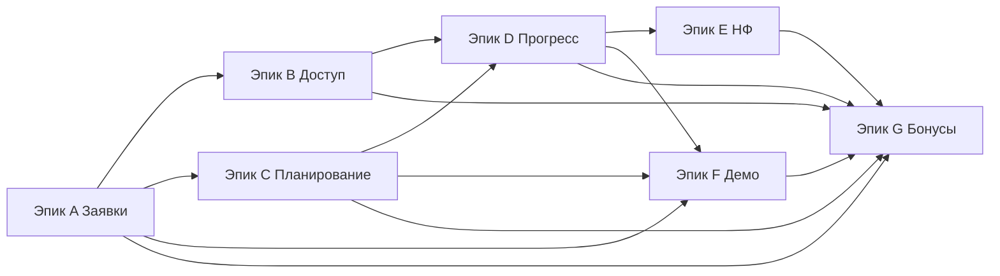
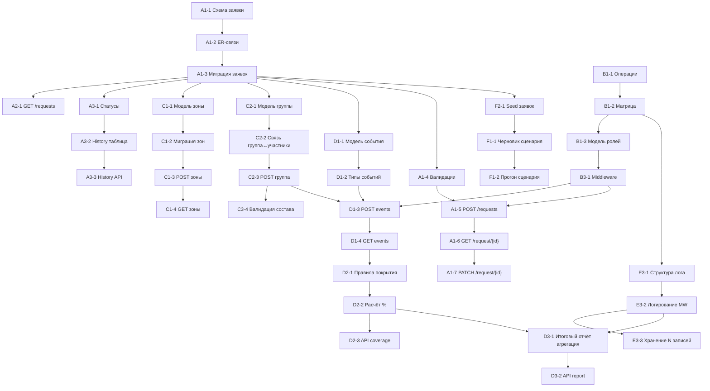
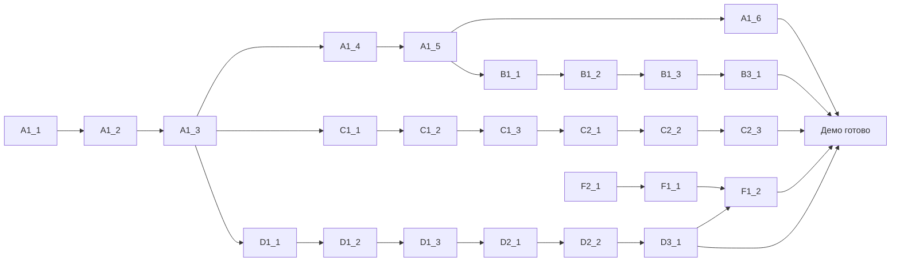

# WBS Детализация (Poisk MVP)

Структура: Эпики → Фичи → Задачи. Метки R1–R4 указывают предполагаемый релиз. Время — ориентир (30–90 минут). Приоритет: сначала блокирующие модели и API для сквозного сценария.

GitHub навигация (основные артефакты):

- [Воркбук](./workbook/Воркбук.md)
- [Детализация WBS (этот файл)](./WBS_Детализация.md)
- [Glossary](./Glossary.md)
- [Beginner Guide](./BEGINNER_GUIDE.md)
- [Валидаторы](./api/Валидаторы.md)
- [Матрица прав](./access/Матрица_прав.md)

Raw версии (для прямого просмотра/встраивания):

- [Воркбук (raw)](./workbook/Воркбук.md)
- [WBS (raw)](./WBS_Детализация.md)
- [Glossary (raw)](./Glossary.md)
- [Beginner Guide (raw)](./BEGINNER_GUIDE.md)
- [Events/History/Logs (raw)](./Events_History_Logs.md)

Легенда столбцов:

- ID — уникальный код задачи
- R — релиз (R1..R4)
- EST — оценка (м, минуты приблизительно)
- DEP — основные зависимости (ID)

---
 
## Диаграмма эпиков (высокий уровень)

---
 
## Эпик A. Журнал заявок

Фичи: A1 Карточка заявки; A2 Список и фильтры; A3 Статусы и история

| ID | R | EST | Описание | DEP |
|----|----|-----|----------|-----|
| A1-1 | R1 | 30 | Схема заявки (поля, типы, обязательность) | - |
| A1-2 | R1 | 45 | ER-связи заявка ↔ зоны/группа/события (эскиз) | A1-1 |
| A1-3 | R1 | 45 | Миграция таблицы заявок v1 | A1-2 |
| A1-4 | R2 | 40 | Формализация валидаций (с `api/Валидаторы.md`) | A1-3 |
| A1-5 | R2 | 60 | API POST /requests (контракт + ошибки) | A1-4 |
| A1-6 | R2 | 40 | API GET /requests/{id} | A1-5 |
| A1-7 | R2 | 50 | API PATCH /requests/{id} (ограничения) | A1-5 |
| A1-8 | R2 | 45 | Seed демо-данных заявок (3) | A1-3 |
| A2-1 | R1 | 60 | API GET /requests (базовый список) | A1-3 |
| A2-2 | R2 | 45 | Фильтры: статус/приоритет/дата | A2-1 |
| A2-3 | R2 | 50 | Пагинация + сортировка | A2-1 |
| A2-4 | R2 | 30 | Метаданные списка (total,page,per_page) | A2-3 |
| A3-1 | R1 | 45 | Модель статусов + переходы | A1-3 |
| A3-2 | R2 | 45 | Таблица history / события статусов | A3-1 |
| A3-3 | R2 | 40 | API GET /requests/{id}/history | A3-2 |
| A3-4 | R4 | 60 | Коды причин переходов | A3-3 |

## Эпик B. Роли и доступ

Фичи: B1 Операции и роли; B2 Правила видимости/изменяемости; B3 Авторизация

| ID | R | EST | Описание | DEP |
|----|----|-----|----------|-----|
| B1-1 | R1 | 15 | Перечень операций | - |
| B1-2 | R1 | 30 | Матрица ролей ↔ операций | B1-1 |
| B1-3 | R2 | 45 | Техмодель roles/operations | B1-2 |
| B2-1 | R2 | 40 | Правила изменения приоритета/статусов | B1-2 |
| B2-2 | R2 | 40 | Ограничения после active | B2-1 |
| B2-3 | R3 | 45 | Маскирование чувствительных полей (резерв) | B2-2 |
| B3-1 | R2 | 60 | Middleware проверки ролей | B1-3 |
| B3-2 | R3 | 45 | Негативные сценарии (403) тесты | B3-1 |
| B3-3 | R3 | 40 | Логирование отказов | B3-1 |
| B3-4 | R4 | 50 | Кэширование правил доступа | B3-1 |

## Эпик C. Планирование выезда

Фичи: C1 Зоны; C2 Группы; C3 Чек-листы

| ID | R | EST | Описание | DEP |
|----|----|-----|----------|-----|
| C1-1 | R1 | 30 | Модель зоны | A1-3 |
| C1-2 | R1 | 30 | Миграция зон | C1-1 |
| C1-3 | R2 | 60 | API POST /requests/{id}/zones (batch) | C1-2 |
| C1-4 | R2 | 40 | API GET /requests/{id}/zones | C1-2 |
| C1-5 | R2 | 40 | Правила статусов зон | C1-2 |
| C2-1 | R2 | 40 | Модель группы | A1-3 |
| C2-2 | R2 | 45 | Связь группа ↔ участники | C2-1 |
| C2-3 | R2 | 50 | API POST /groups | C2-2 |
| C2-4 | R3 | 45 | API PATCH /groups/{id} (старший) | C2-3 |
| C2-5 | R3 | 45 | Шаблон назначения (рендер) | C2-3 |
| C3-1 | R3 | 40 | Справочник чек-листа | C2-3 |
| C3-2 | R3 | 40 | API GET checklist | C3-1 |
| C3-3 | R4 | 45 | Отметка пунктов чек-листа | C3-2 |
| C3-4 | R3 | 40 | Валидация состава (старший/участники) | C2-3 |

## Эпик D. Учёт прогресса

Фичи: D1 События; D2 Покрытие; D3 Отчёт/Журнал

| ID | R | EST | Описание | DEP |
|----|----|-----|----------|-----|
| D1-1 | R1 | 30 | Модель события | A1-3 |
| D1-2 | R1 | 15 | Список типов событий | D1-1 |
| D1-3 | R2 | 60 | API POST /groups/{id}/events | D1-2 |
| D1-4 | R2 | 40 | API GET /groups/{id}/events | D1-3 |
| D2-1 | R2 | 40 | Правила покрытия | C1-5 |
| D2-2 | R2 | 45 | Расчёт % покрытия | D2-1 |
| D2-3 | R3 | 40 | API GET /requests/{id}/coverage | D2-2 |
| D2-4 | R4 | 50 | Повторные/ошибочные отметки | D1-3 |
| D3-1 | R3 | 60 | Итоговый отчёт агрегация | D1-4, D2-2 |
| D3-2 | R3 | 50 | API GET /requests/{id}/report | D3-1 |
| D3-3 | R4 | 50 | Журнал аудита глобальный | B3-3 |
| D3-4 | R4 | 60 | Экспорт отчёта (Markdown/JSON) | D3-2 |

## Эпик E. НФ-минимум

Фичи: E1 Доступность; E2 Безопасность; E3 Логи

| ID | R | EST | Описание | DEP |
|----|----|-----|----------|-----|
| E1-1 | R2 | 30 | Док чек-листа доступности | - |
| E1-2 | R2 | 40 | Формат ошибок (error.code, message) | A1-5 |
| E1-3 | R3 | 30 | Локализация сообщений RU | E1-2 |
| E2-1 | R3 | 30 | Политика минимизации данных | - |
| E2-2 | R2 | 30 | Ограничение размеров полей | A1-5 |
| E2-3 | R4 | 45 | Rate limit черновик | B3-1 |
| E3-1 | R1 | 30 | Структура записи лога | B1-2 |
| E3-2 | R2 | 45 | Логирование в middleware | E3-1 |
| E3-3 | R3 | 40 | Хранение последних N записей | E3-2 |
| E3-4 | R4 | 50 | Архив/ротация логов | E3-3 |

## Эпик F. Окружение / демо

Фичи: F1 Сценарий; F2 Демо-данные; F3 Памятки

| ID | R | EST | Описание | DEP |
|----|----|-----|----------|-----|
| F1-1 | R2 | 40 | Черновик сценария | A1-8 |
| F1-2 | R3 | 45 | Прогон сценария | F1-1 |
| F1-3 | R3 | 40 | Тайминг и cues | F1-2 |
| F2-1 | R1 | 45 | Seed заявок (3) | A1-3 |
| F2-2 | R3 | 40 | Seed зон/групп | C1-5, C2-3 |
| F2-3 | R3 | 40 | События прогресса (псевдо) | D1-4 |
| F3-1 | R2 | 30 | Памятка диспетчера | F1-1 |
| F3-2 | R2 | 30 | Памятка координатора | F1-1 |
| F3-3 | R2 | 30 | Памятка старшего группы | F1-1 |

## Эпик G. Бонусы / расширения

Фичи: G1 OpenAPI; G2 Метрики; G3 Экспорт; G4 Оптимизация

| ID | R | EST | Описание | DEP |
|----|----|-----|----------|-----|
| G1-1 | R4 | 60 | OpenAPI YAML генерация | A1-7 |
| G1-2 | R4 | 40 | Примеры curl | G1-1 |
| G2-1 | R4 | 50 | Таймлайн покрытия | D1-4, D2-2 |
| G2-2 | R4 | 50 | Средняя скорость закрытия зон | D2-2 |
| G3-1 | R4 | 45 | Экспорт отчёта Markdown | D3-2 |
| G3-2 | R4 | 45 | Экспорт отчёта JSON bundle | D3-2 |
| G4-1 | R4 | 45 | Кэш матрицы прав | B3-1 |
| G4-2 | R4 | 50 | Rate limit (per IP/role) | E2-3 |
| G4-3 | R4 | 50 | Индексы БД (анализ запросов) | A2-3 |
| G4-4 | R4 | 60 | Нагрузочный скрипт base | A2-3 |

## Эпик H. Дизайн / UI

Фичи: H1 UI-гайд; H2 Базовые экраны; H3 Улучшения UX

| ID | R | EST | Описание | DEP |
|----|----|-----|----------|-----|
| H1-1 | R1 | 45 | Мини-гайд: цвета, шрифты, отступы | - |
| H1-2 | R1 | 60 | Прототип экрана списка заявок (wireframe) | H1-1 |
| H2-1 | R2 | 60 | Экран списка заявок (верстка) | A2-1, H1-2 |
| H2-2 | R2 | 50 | Экран карточки заявки (основные поля) | A1-6, H1-2 |
| H2-3 | R2 | 40 | Экран групп/зон (минимум) | C1-4, C2-3 |
| H3-1 | R3 | 45 | Подсветка статусов / приоритетов | H2-1 |
| H3-2 | R3 | 40 | Инлайн ошибки валидации (формы) | A1-5, H2-2 |
| H3-3 | R4 | 50 | Тематическое улучшение (доступность контраста) | H1-1 |
| H3-4 | R4 | 45 | Быстрые действия (context buttons) | H2-1 |

---

## Сравнение слоёв: Events vs History vs Logs

Таблица вынесена в отдельный файл: `Events_History_Logs.md`.

---

---
 
## Диаграмма зависимостей (Mermaid)

## Критический путь (Mermaid)

## Сводка распределения по релизам

- R1: Сдача подготовки и описания (`Веб-Технологии/Курсовые/poisk-mvp-planning`) — структура документации, базовый WBS, валидаторы, матрица прав (черновик), ER-эскиз, план релизов.
- R2: A1-1..A1-3, A2-1, A3-1, C1-1..C1-2, D1-1..D1-2, B1-1..B1-2, E3-1, F2-1 (фундамент данных и минимум для демонстрации базы CRUD).
- R3: Остаток CRUD / фильтры / группы / авторизация / базовые НФ / сценарий / памятки (полноценный MVP поток «заявка→группа→прогресс→отчёт»).
- R4: Метрики, экспорт, оптимизация, формальная спецификация (добавочная ценность и улучшения).

## Процесс исполнения

1. Заводим тикет (ID из таблицы) → короткое описание → критерии приёмки.
2. Реализация в ветке feature/`<ID>`.
3. Локальные проверки (curl примеры) прикладываются в описание коммита.
4. Обновляется соответствующий файл документации (`api/`, `access/`, `progress/`...).
5. Merge при выполнении DoD.

Definition of Done:

- Код + проверенный ручной сценарий.
- Все входные ошибки обрабатываются (400/403/404).
- Документация обновлена.
- Нет «висячих» TODO без ссылки на задачу.

## Метрики контроля

- Velocity: количество закрытых задач за неделю.
- Прогресс MVP: % завершённых задач эпиков A–F (R1–R3 целевое ≥90%).
- Перевыпуск/рефактор: ≤10% задач требуют второй итерации.

## Риски (привязка к эпикам)

- Статусы (A3): рост сложности переходов → фиксировать модель в R1.
- Авторизация (B3): задержка middleware → временно логика на уровне контроллеров.
- Отчёт (D3): недооценка агрегаций → ранний черновик структуры в конце R2.

---
Документ синхронизирован с разделом 7 основного `Воркбук.md`. Обновляйте обе части через этот файл (source of truth) и затем копируйте агрегированное описание при необходимости.
